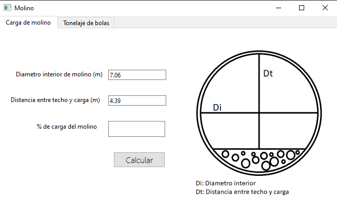
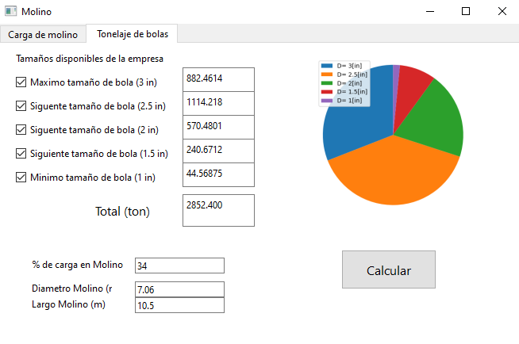

# MoliApp
Aplicación para cálculo de algunos datos de interés para molinos de bola.
# Requisitos
```
PyQty6
numpy
matplotlib
```
# Ejecución
```
MoliApp_v1.py desde IDE
```

## Calculo de carga de molino: 
Calcula el porcentaje de carga de un molino de bola.



## Tonelaje de bolas:
Calcula el tonelaje de bolas para diametros de bola comerciales.

El programa permite chequear o deschequear los diametros de bola que se quieran o no utilizar en el cálculo. Además el gráfico mostrado se actualiza cada vez que se ejecute el programa para calcular.
Aplicación para calculo de algunos datos de interes para molinos de bola.
